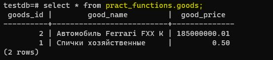
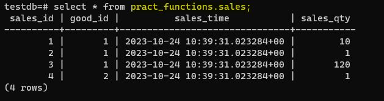
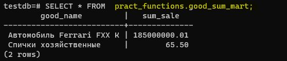

# Домашнее задание №14 (Тема "Хранимые функции и процедуры")

<br>__*На виртуальной машине развернул кластер Postgres версии 15. Создал базу данных testdb.*__ 
<br>__*В новой БД создал схему pract_functions, а в ней уже создал все необходимые таблицы в соответствии с приложенным файлом, заполнил соответсвующими данными.*__

<br>__*Таблица goods (товары):*__



<br>__*Таблица sales (продажи):*__



<br>__*Таблицу-витрину good_sum_mart заполнил пока вручную, чтобы она отображала актуальную информацию.*__



<br>__*Для того, чтобы витрина данных автоматически хранила актуальную информацию по продажам, подготовлен следующий триггер на таблицу sales, который вычисляет при каждой продаже сумму и записывает её в витрину:*__


````
CREATE OR REPLACE FUNCTION tf_sales_trigg()
RETURNS trigger
AS
$$
DECLARE 
	new_good_name varchar(63);
	new_sum_sale numeric(16,2); 
	old_good_name varchar(63);
	old_sum_sale numeric(16,2);
BEGIN

CASE TG_OP
	WHEN 'INSERT'  THEN 	
		SELECT g.good_name , NEW.sales_qty*g.good_price sum_sale
		INTO new_good_name, new_sum_sale 
		FROM pract_functions.goods g
		WHERE g.goods_id = NEW.good_id;

		IF NOT EXISTS ( SELECT w.good_name 
				FROM pract_functions.good_sum_mart w 
				WHERE w.good_name = new_good_name ) 
		THEN 
			INSERT INTO pract_functions.good_sum_mart (good_name, sum_sale) 
			VALUES ( new_good_name, new_sum_sale ); 
		ELSE
			UPDATE pract_functions.good_sum_mart w 
			SET sum_sale = sum_sale + new_sum_sale 
			where w.good_name = new_good_name;
		END IF; 

	WHEN 'UPDATE' THEN
		SELECT g.good_name , NEW.sales_qty*g.good_price sum_sale
		INTO new_good_name ,  new_sum_sale
		FROM pract_functions.goods g 
		WHERE g.goods_id = NEW.good_id;

		SELECT g.good_name, g.good_price*OLD.sales_qty sum_sale
		INTO old_good_name ,  old_sum_sale
		FROM pract_functions.goods g 
		WHERE g.goods_id = OLD.good_id;

		IF EXISTS ( 	SELECT w.good_name 
				FROM pract_functions.good_sum_mart w 
				WHERE w.good_name = old_good_name )
		THEN
			UPDATE pract_functions.good_sum_mart w
			SET sum_sale = sum_sale - old_sum_sale
			WHERE w.good_name = old_good_name ;
		END IF; 

		IF EXISTS ( 	SELECT w.good_name 
				FROM pract_functions.good_sum_mart w 
				WHERE w.good_name = new_good_name )
		THEN
			UPDATE pract_functions.good_sum_mart w
			SET sum_sale = sum_sale + new_sum_sale 
			WHERE w.good_name = new_good_name ;
		ELSE
			INSERT INTO pract_functions.good_sum_mart ( good_name, sum_sale ) 
			VALUES ( new_good_name , new_sum_sale );
		END IF;

	WHEN 'DELETE' THEN
		SELECT g.good_name , OLD.sales_qty*g.good_price sum_sale
		INTO old_good_name ,  old_sum_sale
		FROM pract_functions.goods g 
		WHERE g.goods_id = OLD.good_id;

		IF EXISTS ( 	SELECT w.good_name 
				FROM pract_functions.good_sum_mart w 
				WHERE w.good_name = old_good_name ) 
		THEN
			UPDATE pract_functions.good_sum_mart w
			SET sum_sale = sum_sale - old_sum_sale
			WHERE w.good_name = old_good_name;
		END IF;
END CASE;
DELETE FROM pract_functions.good_sum_mart WHERE sum_sale <= 0;

RETURN NULL;
END;
$$ LANGUAGE plpgsql;

CREATE TRIGGER tr_sales_trigg
AFTER INSERT OR UPDATE OR DELETE
ON pract_functions.sales
FOR EACH ROW
EXECUTE PROCEDURE  tf_sales_trigg();


