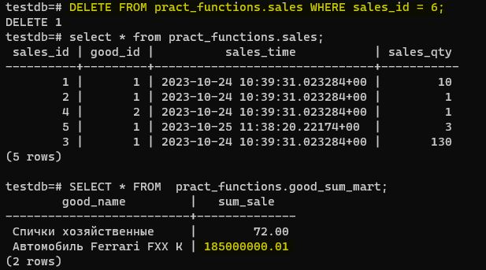

# Домашнее задание №14 (Тема "Хранимые функции и процедуры")

<br>__*На виртуальной машине развернул кластер Postgres версии 15. Создал базу данных testdb.*__ 
<br>__*В новой БД создал схему pract_functions, а в ней уже создал все необходимые таблицы в соответствии с приложенным файлом, заполнил соответсвующими данными.*__

<br>__*Таблица goods (товары):*__


<br>__*Таблица sales (продажи):*__


<br>__*Таблицу-витрину good_sum_mart заполнил пока вручную, чтобы она отображала актуальную информацию.*__


<br>__*Для того, чтобы витрина данных автоматически хранила актуальную информацию по продажам, подготовлен следующий триггер на таблицу sales, который вычисляет при каждой продаже общую сумму и записывает её в витрину:*__


````
CREATE OR REPLACE FUNCTION tf_sales_trigg()
RETURNS trigger
AS
$$
DECLARE 
	new_good_name varchar(63);
	new_sum_sale numeric(16,2); 
	old_good_name varchar(63);
	old_sum_sale numeric(16,2);
BEGIN

CASE TG_OP
	WHEN 'INSERT'  THEN 	
		SELECT g.good_name , NEW.sales_qty*g.good_price sum_sale
		INTO new_good_name, new_sum_sale 
		FROM pract_functions.goods g
		WHERE g.goods_id = NEW.good_id;

		IF NOT EXISTS ( SELECT w.good_name 
				FROM pract_functions.good_sum_mart w 
				WHERE w.good_name = new_good_name ) 
		THEN 
			INSERT INTO pract_functions.good_sum_mart (good_name, sum_sale) 
			VALUES ( new_good_name, new_sum_sale ); 
		ELSE
			UPDATE pract_functions.good_sum_mart w 
			SET sum_sale = sum_sale + new_sum_sale 
			where w.good_name = new_good_name;
		END IF; 

	WHEN 'UPDATE' THEN
		SELECT g.good_name , NEW.sales_qty*g.good_price sum_sale
		INTO new_good_name ,  new_sum_sale
		FROM pract_functions.goods g 
		WHERE g.goods_id = NEW.good_id;

		SELECT g.good_name, OLD.sales_qty*g.good_price sum_sale
		INTO old_good_name ,  old_sum_sale
		FROM pract_functions.goods g 
		WHERE g.goods_id = OLD.good_id;

		IF EXISTS ( 	SELECT w.good_name 
				FROM pract_functions.good_sum_mart w 
				WHERE w.good_name = old_good_name )
		THEN
			UPDATE pract_functions.good_sum_mart w
			SET sum_sale = sum_sale - old_sum_sale
			WHERE w.good_name = old_good_name ;
		END IF; 

		IF EXISTS ( 	SELECT w.good_name 
				FROM pract_functions.good_sum_mart w 
				WHERE w.good_name = new_good_name )
		THEN
			UPDATE pract_functions.good_sum_mart w
			SET sum_sale = sum_sale + new_sum_sale 
			WHERE w.good_name = new_good_name ;
		ELSE
			INSERT INTO pract_functions.good_sum_mart ( good_name, sum_sale ) 
			VALUES ( new_good_name , new_sum_sale );
		END IF;

	WHEN 'DELETE' THEN
		SELECT g.good_name , OLD.sales_qty*g.good_price sum_sale
		INTO old_good_name ,  old_sum_sale
		FROM pract_functions.goods g 
		WHERE g.goods_id = OLD.good_id;

		IF EXISTS ( 	SELECT w.good_name 
				FROM pract_functions.good_sum_mart w 
				WHERE w.good_name = old_good_name ) 
		THEN
			UPDATE pract_functions.good_sum_mart w
			SET sum_sale = sum_sale - old_sum_sale
			WHERE w.good_name = old_good_name;
		END IF;
END CASE;
DELETE FROM pract_functions.good_sum_mart WHERE sum_sale <= 0;

RETURN NULL;
END;
$$ LANGUAGE plpgsql;

CREATE TRIGGER tr_sales_trigg
AFTER INSERT OR UPDATE OR DELETE
ON pract_functions.sales
FOR EACH ROW
EXECUTE PROCEDURE  tf_sales_trigg();
````

<br>__*Проверяю теперь, как отрабатывает триггер на манипуляции с данными в таблице sales.*__

<br>__*Первый тест, на вставку новой записи в таблицу sales: вставляем пятую строчку - допустим продали 3 коробка спичек - это  3х0.5=1.5, следовательно 65.5+1.5=67.0. Проверяю, в витрине тоже 67.0:*__


<br>__*Второй тест, тоже на вставку новой записи в таблицу sales: вставляем шестую строчку - допустим продали 2 автомобиля - это  2х185000000.01=370000000.02, следовательно 185000000.01+370000000.02=555000000.03. Проверяю, в витрине тоже 555000000.03:*__


<br>__*Следующий тест, третий, на изменение записи в таблице sales: меняю значение 3-ей строчки со 120 на 100 - это (120-100)х0.5=10, значит в витрине сумма должна уменьшиться на 10. Проверяю, было 67.0, теперь стало 57.0, т.е. уменьшилось на 10:*__


<br>__*Далее четвертый тест, на изменение записи в таблице sales: меняю значение 3-ей строчки со 100 на 130 - это (130-100)х0.5=15, значит в витрине сумма должна увеличиться на 15. Проверяю, было 57.0, теперь стало 72.0, т.е. увеличилось на 15:*__


<br>__*Теперь тесты на удаление записи из таблицы sales. Пятый тест: удоляю 6-ую строчку, которая о продаже 2-х автомобилей: 2х185000000.01=370000000.02. Значит в витрине сумма должна уменьшиться с 555000000.03 на 370000000.02. Проверяю, стало 185000000.01, всё корректно:*__



<br>__*Последний тест, шестой. Удолю в таблице sales строку с sales_id=1, о продаже 10 позиций спичек.*__


